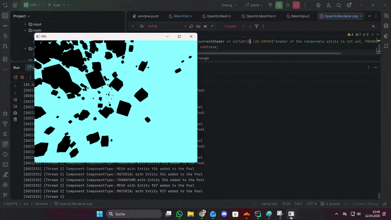

# MyFPS Engine

MyFPS is a custom C++ OpenGL engine prototype. The project focuses on engine architecture rather than a finished game: ECS-style component storage, asset management, render command buffering, viewport rendering, camera/input handling, profiling utilities, and early networking experiments.

The current demo renders a scene through an OpenGL backend and uses a `RenderBuffer` to turn scene data into sorted draw commands.

---

## Showcase

| Feature | Preview |
|:--------|:--------|
| **Rendering pipeline and hot loading** |  |

---

## Core Features

### Data-Oriented ECS

The engine uses a small custom registry with sparse-set component pools:

- **Dense component storage:** Components are stored in compact vectors for cache-friendly iteration.
- **Entity lookup:** Sparse arrays map entity IDs to component indices.
- **Component masks:** Entities track which components they own through bit flags.
- **Typed access:** Components are added and queried through templated registry functions.

Currently supported render-relevant components:

- `TransformComponent`
- `MeshComponent`
- `MaterialComponent`

### Rendering Pipeline

Rendering is split into a few clear stages:

1. Scene data lives in the registry.
2. `RenderBuffer` collects entities with mesh, material, and transform data.
3. Render commands are sorted by shader, material, and mesh.
4. `RendererSystem` renders one or more viewports.
5. `OpenGLRenderer` submits the final draw calls.

This keeps the renderer focused on draw commands instead of directly walking gameplay data.

### Viewport System

The renderer already supports multiple viewports through `ViewportManager` and `RendererSystem`. This is intended for features such as editor views, split screen, debug overlays, or a minimap camera.

### Assets

Assets are managed through typed managers using numeric IDs and names. Components reference mesh and shader assets through asset handlers instead of owning the assets directly.

Current asset types:

- Shader assets via `AssetManager::Manager<SHADER::IShader>`
- Mesh assets via `AssetManager::Manager<MESH::IMeshPair>`

### Camera and Input

The project includes a fly-style camera controller using keyboard movement and mouse rotation. The camera exposes view/projection matrices for the renderer.

### Profiling and Logging

The profiling system includes a frame timer and a logger manager with console, file, and UI logger hooks. Logging macros are compiled out unless `ENGINE_DEBUG` is enabled.

### Networking Experiments

There is an early UDP networking layer for player state packets and a separate experimental server API stub. These systems are not yet part of a polished gameplay loop.

---

## Architecture Overview

High-level runtime flow:

```text
main.cpp
  -> RendererContext
       -> GLFWWindow
       -> ViewportManager
       -> RendererSystem
            -> IRenderer
            -> OpenGLRenderer

  -> SceneContext
       -> Camera
       -> CameraController
       -> InputKeyboard / InputMouse
       -> Registery
            -> Pool<TransformComponent>
            -> Pool<MeshComponent>
            -> Pool<MaterialComponent>

  -> AssetContext
       -> Shader manager
       -> Mesh manager

  -> FrameContext
       -> RenderBuffer
            -> sorted drawCommand list
```

Important rendering path:

```text
Registry -> RenderBuffer -> RendererSystem -> OpenGLRenderer -> OpenGL
```

---

## Tech Stack

- **Language:** C++17
- **Graphics API:** OpenGL
- **Windowing:** GLFW
- **OpenGL loading:** GLAD
- **Build system:** CMake
- **Tests:** GoogleTest
- **Platform focus:** Windows

---

## Build

### Requirements

- CMake 3.20+
- A C++17-capable compiler
- OpenGL-capable graphics driver

### Build Game

```powershell
mkdir build
cd build
cmake ..
cmake --build . --target Game
```

### Build Tests

```powershell
cmake --build . --target EngineTests
ctest
```

---

## Current Limitations

- The demo scene is still mostly created in code.
- Threading rules around scene mutation and render-buffer updates need to be formalized.
- Some systems are prototypes or stubs, especially editor/API/networking pieces.
- Materials are still minimal.
- The renderer is OpenGL-only for now, although an `IRenderer` abstraction exists.

---

## Roadmap

- [ ] Material color and shader parameter controls
- [ ] Minimap using a second camera and viewport
- [ ] Small ImGui-based debug inspector
- [ ] Scene creation cleanup outside of `main.cpp`
- [ ] Stronger tests for ECS removal, asset lifetime, and render-buffer snapshots
- [ ] OpenGL instancing
- [ ] Basic physics/collision experiments
- [ ] Scene save/load

---

## Status

This is a learning-focused engine prototype. The goal is to build and understand the core systems behind a small game engine while keeping the codebase small enough to iterate on.
